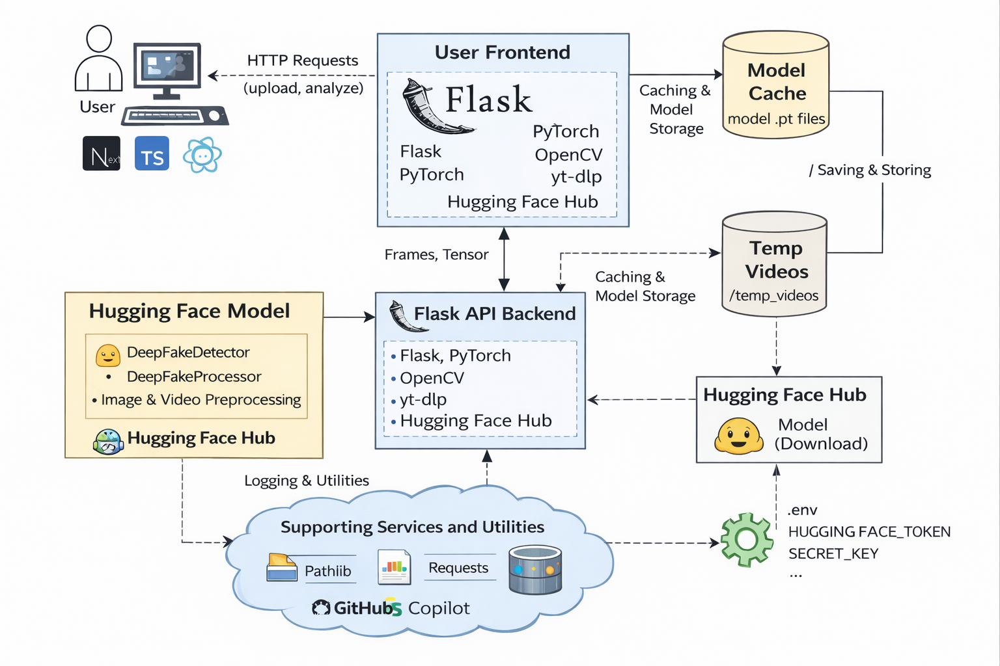
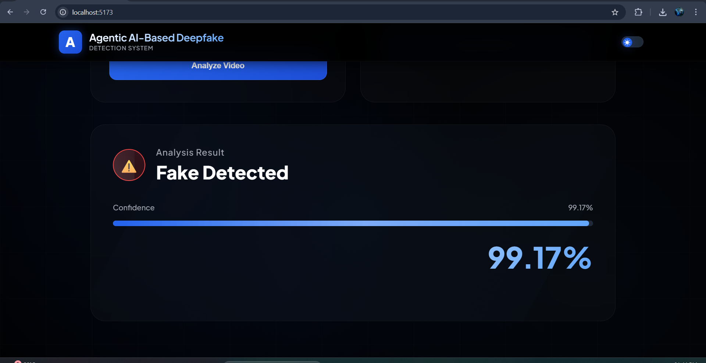

# Title of the Project

The **Agentic-AI-Based-Deepfake-Detection-System** is a research-oriented AI project focused on studying and evaluating deepfake detection techniques under real-world conditions. The project explores how deep learning models can be integrated into a practical system capable of analyzing manipulated videos using both uploaded files and URL-based inputs.

The system emphasizes practical usability, multimedia forensics, and evaluation of pretrained deepfake detection approaches rather than proposing an entirely new deep learning architecture.

## About

The **Agentic-AI-Based-Deepfake-Detection-System** was developed to study the growing challenges posed by AI-generated fake videos, including misinformation, impersonation, and digital media manipulation.

The project primarily focuses on understanding how existing deepfake detection models behave in practical environments instead of only controlled benchmark datasets. The work combines research understanding with prototype implementation to bridge the gap between theoretical deepfake detection research and real-world usability.

The implemented prototype supports:
- Local video uploads
- URL-based video analysis
- Frame extraction and preprocessing
- Model inference and confidence-based prediction

The system uses pretrained deep learning architectures such as CNN-based spatial analysis and temporal sequence evaluation techniques to analyze manipulated videos.

Unlike many research-only approaches, this project attempts to evaluate how detection systems behave under real-world conditions such as:
- compressed videos
- varying resolutions
- limited frame sampling
- uncontrolled video quality
- social-media-style inputs

The project demonstrates how multimedia forensics and AI-based analysis can be combined into an accessible prototype system for educational and research purposes.

## Features

- Deepfake video detection using pretrained deep learning models  
- Support for both uploaded videos and URL-based video analysis  
- Video frame extraction and preprocessing using OpenCV  
- CNN-based spatial feature analysis  
- Temporal sequence analysis using deep learning techniques  
- Confidence-based REAL / FAKE prediction system  
- Edge-device oriented execution without mandatory cloud dependency  
- Lightweight prototype implementation for research validation  
- Automatic temporary file handling and cleanup  
- Modular architecture for experimentation and future improvements  

## Requirements

* **Operating System:** Windows 10 / Windows 11 or Ubuntu 20.04+  
* **Development Environment:** Python 3.10 or later  
* **Frontend Framework:** React (Vite + TypeScript)  
* **Backend Framework:** Flask  
* **Deep Learning Framework:** PyTorch  
* **Video Processing Library:** OpenCV  
* **Image Processing Library:** Pillow  
* **URL Video Downloader:** yt-dlp  
* **IDE:** Visual Studio Code (recommended)  
* **Version Control:** Git and GitHub  
* **Additional Dependencies:** All required dependencies are listed in `requirements.txt` and `package.json`  

## System Architecture

## Output

#### Home Page

#### Video Upload

#### URL-Based Video Analysis

#### Deepfake Detection Output

## Results and Impact

The **Agentic-AI-Based-Deepfake-Detection-System** demonstrates the practical integration of AI-based multimedia forensics into a usable prototype environment.

### Key Contributions:
- Evaluation of deepfake detection models in practical conditions  
- Integration of video preprocessing and inference pipelines  
- Real-world testing using uploaded and URL-based videos  
- Analysis of model behavior on compressed and non-ideal inputs  
- Prototype implementation for educational and research purposes  

### Impact

The project highlights the importance of evaluating AI models outside controlled datasets and demonstrates how existing deepfake detection approaches can be adapted into accessible real-world systems.

This work contributes toward understanding:
- the limitations of deepfake detection systems
- practical deployment challenges
- usability of AI-powered multimedia forensic tools

The project also serves as a foundation for future research in:
- edge AI
- multimedia security
- explainable deepfake detection
- real-time forensic systems

## Technologies Used

- Python  
- Flask  
- React.js  
- TypeScript  
- PyTorch  
- OpenCV  
- Pillow  
- yt-dlp  
- REST API  

## Future Enhancements

- Real-time live-stream deepfake detection  
- Audio deepfake detection integration  
- Explainable AI visualization using heatmaps  
- Edge-device optimization using quantization techniques  
- Smartphone and embedded-device deployment  
- Hybrid edge-cloud forensic analysis  
- Integration with social media verification systems  
- Improved evaluation on diverse real-world datasets  

## Acknowledgment

This project was developed as a research-oriented prototype with the support of existing open-source deepfake detection research and pretrained model resources.

Special acknowledgment to:

- **Naman712/Deep-fake-detection**
- Hugging Face open-source model resources and community contributions

for providing valuable implementation references, pretrained model integration ideas, and research inspiration related to deepfake detection workflows.

This project primarily focuses on studying, evaluating, and adapting deepfake detection techniques for practical and real-world usage scenarios.

## Articles Published / References

1. A. Rössler et al., “FaceForensics++: Learning to Detect Manipulated Facial Images,” Proc. IEEE/CVF Int. Conf. Computer Vision (ICCV), 2019.  
2. A. Rössler et al., “FaceForensics: A Large-scale Video Dataset for Forgery Detection in Human Faces,” Proc. British Machine Vision Conf. (BMVC), 2018.  
3. D. Afchar et al., “MesoNet: A Compact Facial Video Forgery Detection Network,” Proc. IEEE Int. Workshop on Information Forensics and Security (WIFS), 2018.  
4. B. Dolhansky et al., “The DeepFake Detection Challenge (DFDC) Dataset,” arXiv preprint arXiv:2006.07397, 2020.  
5. A. Haliassos et al., “Lips Don’t Lie: A Generalisable and Robust Approach to Face Forgery Detection,” Proc. IEEE/CVF Conf. Computer Vision and Pattern Recognition (CVPR), 2021.  
6. U. A. Ciftci and I. Demir, “FakeCatcher: Detection of Synthetic Portrait Videos Using Biological Signals,” IEEE Trans. Pattern Analysis and Machine Intelligence, 2020.  
7. S. Hu et al., “Exposing GAN-generated Faces Using Inconsistent Corneal Specular Highlights,” Proc. IEEE/CVF Conf. Computer Vision and Pattern Recognition (CVPR), 2021.  
8. X. Wang et al., “ASVspoof 2019: A Large-scale Public Database of Spoofing and Countermeasures for Automatic Speaker Verification,” Proc. Interspeech, 2019.  
9. J. Jung et al., “RawNet2: End-to-End Deep Neural Network for Audio Spoofing Detection,” Proc. IEEE Int. Conf. Acoustics, Speech and Signal Processing (ICASSP), 2021.  
10. J. Yi et al., “Audio Deepfake Detection: A Survey,” ACM Computing Surveys, 2023.  
11. F. Chollet, “Xception: Deep Learning with Depthwise Separable Convolutions,” Proc. IEEE Conf. Computer Vision and Pattern Recognition (CVPR), 2017.  
12. Y. Li et al., “Detecting Deepfake Videos by Analyzing Eye Blinking Patterns,” Proc. IEEE Int. Workshop on Information Forensics and Security (WIFS), 2018.  
13. Y. Li et al., “In Ictu Oculi: Exposing AI-generated Fake Face Videos by Detecting Eye Blinking,” Proc. IEEE Int. Workshop on Information Forensics and Security (WIFS), 2018.  
14. P. Zhou et al., “Two-Stream Neural Networks for Tampered Face Detection,” Proc. IEEE Conf. Computer Vision and Pattern Recognition Workshops, 2017.  
15. N. Nguyen et al., “Capsule-Forensics: Using Capsule Networks to Detect Forged Images and Videos,” Proc. IEEE Int. Conf. Acoustics, Speech and Signal Processing (ICASSP), 2019.  
16. Y. Li et al., “Face Warping Artifacts for Deepfake Detection,” Proc. IEEE/CVF Conf. Computer Vision and Pattern Recognition Workshops, 2019.  
17. Y. Li et al., “Multi-task Learning for Detecting and Segmenting Manipulated Facial Imagery,” Proc. IEEE/CVF Conf. Computer Vision and Pattern Recognition, 2020.  
18. S. Sabir et al., “Deepfake Detection Using Recurrent Neural Networks,” Proc. IEEE Int. Conf. Acoustics, Speech and Signal Processing (ICASSP), 2019.  
19. A. Guera and E. Delp, “Deepfake Video Detection Using Recurrent Neural Networks,” Proc. IEEE Int. Conf. Advanced Video and Signal Based Surveillance, 2018.  
20. J. Zhao et al., “Generalizing Deepfake Detection Using Meta-Learning,” Proc. AAAI Conf. Artificial Intelligence, 2021.  
21. T. Kinnunen et al., “CNN-based Spoofing Detection for Automatic Speaker Verification,” Proc. Interspeech, 2017.  
22. T. Tak et al., “LFCC Features for Audio Spoof Detection,” Proc. IEEE Automatic Speaker Verification and Spoofing Countermeasures Challenge, 2019.  
23. H. Tak et al., “End-to-End Anti-Spoofing with Raw Waveforms,” Proc. IEEE Int. Conf. Acoustics, Speech and Signal Processing (ICASSP), 2021.  
24. A. Lavrentyeva et al., “Deepfake Audio Detection Using Spectrogram CNNs,” Proc. Interspeech, 2017.  
25. A. Tariq et al., “A Survey on Deepfake Detection and Countermeasures,” Journal of Information Security and Applications, 2022.  
26. V. Verdoliva, “Media Forensics and Deepfake Detection: State of the Art and Challenges,” IEEE Journal of Selected Topics in Signal Processing, 2020.  
27. D. Cozzolino et al., “Combining Spatial and Temporal Features for Deepfake Detection,” Proc. IEEE Int. Workshop on Information Forensics and Security (WIFS), 2019.  
28. M. Tan and Q. Le, “EfficientNet: Rethinking Model Scaling for CNNs,” Proc. International Conference on Machine Learning (ICML), 2019.  
29. J. Jung et al., “RawNet: End-to-End Speaker Verification from Raw Waveform,” Proc. Interspeech, 2019.  
30. H. Tak et al., “End-to-End Neural Speaker Verification with Raw Waveforms,” Proc. Interspeech, 2020.